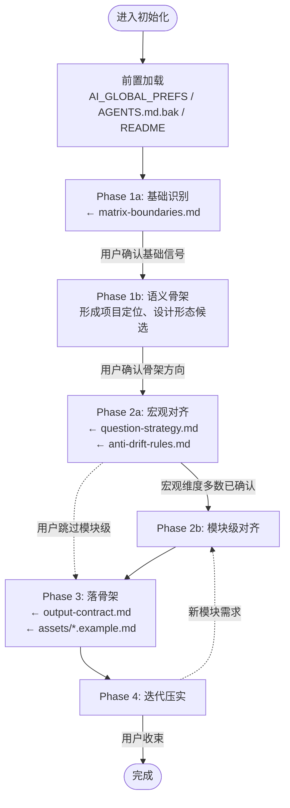

# 控制面文档初始化协议

> 本文档是"初始化"场景的完整操作协议。按阶段顺序执行。

**协议心态**：本协议描述的阶段和步骤是认知梯度的参考路径，不是追求快速填满模板的任务清单。目标是在充分理解用户意图和项目现实后，把现有治理信息完整迁移并重新编译为固定控制面矩阵；旧治理拓扑只作为输入，迁移完成后不保留为第二套事实源。阶段边界帮助组织思考，不代替用户对关键取舍的裁决。

## 流程概览



---

## 通用规则

以下规则贯穿所有阶段。

### 跨层次信息处理

用户可能在任何阶段提供跨层次的信息（例如在 Phase 1b 中给出 Phase 2b 级别的模块设计细节）。不要打断或要求用户"留到后面说"。在阶段转换时，将所有已获信息按归属层次整理呈现，标注哪些维度已有候选结论、哪些仍需深入。后续阶段对已触及的维度应复用而非重问。

### 信息确定性标签

在阶段转换快照中，对已获取的信息标注确定性：

| 标签 | 含义 | 使用场景 |
|------|------|---------|
| ✅ 已确认 | 用户明确裁定 | 用户给了清晰陈述且无后续矛盾 |
| 💡 候选 | AI 推断或用户模糊意图 | 用户提过但未明确拍板，或 AI 从代码/上下文推断 |
| ❓ 待裁决 | 明确悬而未决 | 用户表示"不确定"、"还没想好"，或讨论中被搁置 |
| ⚠️ 有冲突 | 与已有信息矛盾 | 用户后续表态与之前的 ✅ 或 💡 不一致 |

**使用约束**：
- 标签只出现在阶段转换快照中，不需要在每条回复中标注
- ⚠️ 有冲突须主动提出，由用户裁定后转为其他标签
- Phase 3 落骨架时收束为二值：✅ → 写入正文；💡/❓/⚠️ → `【待裁决】`或省略

### 细节保全

用户在对齐阶段的细节想法同样重要。每个有价值的信息点都应在阶段转换快照中归入对应维度并标注确定性标签，确保后续阶段可追溯、不丢失。

---

## 前置加载

在进入阶段流程之前：

1. 读取 [AI_GLOBAL_PREFS.md](../AI_GLOBAL_PREFS.md)，将其内容视为已确认的跨项目默认事实（落文时按 [matrix-boundaries.md](../references/matrix-boundaries.md) 归入项目对应控制文档）。AI_GLOBAL_PREFS.md 本身不部署到目标项目。
2. 主动识别并读取已有 AGENTS、CLAUDE、架构说明、AI 规则、项目意图、开发规范及其 `.bak` 等旧治理文档。它们都是迁移输入，不因文件名或篇幅获得继续保留的权利。
3. 若项目已有 `README.md`，主动读取作为高价值信息源；README 有独立的人类受众，不属于待删除的旧治理文档，也不自动取得控制面事实权。
4. 记录旧治理文档清单，供 Phase 4 在确认内容已迁移后统一删除。存在互相冲突、仍待用户裁决或无法合理归入固定矩阵的信息时，先请求用户决定，不把保留旧文件当作兜底。

---

## Phase 1a：基础识别

**目标**：快速扫描项目的物理存在，形成基础设施层面的事实信号。

| 步骤 | 动作 |
|------|------|
| 1a.1 | 扫描项目文件结构、技术栈、入口文件、配置 |
| 1a.2 | 识别已有文档（README / 旧 AGENTS.md / 其他） |
| 1a.3 | 查阅 [matrix-boundaries.md](../references/matrix-boundaries.md)，确认固定核心矩阵，并判断是否出现独立 ARCHITECTURE 和模块文档的信号 |
| 1a.4 | 向用户呈现基础识别结果 |

**产出格式**：

```markdown
### Phase 1a 基础识别

**技术栈**：{语言 / 框架 / 关键工具}
**关键结构**：{主要目录或入口}
**已有文档**：{README / 旧 AGENTS.md / 无}

**固定核心矩阵**：AGENTS.md / CLAUDE.md / docs/INTENT.md / docs/WORKFLOW.md / docs/SPEC.md
**扩展信号**：
| 扩展 | 是否需要进一步判断 | 依据 |
|------|------------------|------|
| ARCHITECTURE.md | ✅ / ❓ | 是否存在独立的全局逻辑组件模型、依赖、数据所有权或跨模块不变量 |
| modules/*.md | ✅ / ❓ | 是否存在需要独立加载和维护的模块级细节 |
```

**禁止**：
- 在此阶段直接写成控制文档结论
- 跳过呈现直接进入语义分析

**退出条件**：用户确认基础信号大致正确，或纠正了关键事实

---

## Phase 1b：语义骨架

**目标**：基于基础识别，形成项目定位、核心设计形态、主要运转逻辑的候选判断。

| 步骤 | 动作 |
|------|------|
| 1b.1 | 基于代码、README、已有文档，推断项目的核心定位和设计意图 |
| 1b.2 | 形成主要运转逻辑的候选理解（项目如何从输入到输出） |
| 1b.3 | 识别关键设计决策的候选判断（为什么是这样而不是那样） |
| 1b.4 | 判断全局逻辑架构是否已经形成独立认知边界；只有满足条件时才提出 `docs/ARCHITECTURE.md` 候选 |
| 1b.5 | 向用户呈现语义骨架候选，明确标注为候选而非结论 |

**产出格式**：

```markdown
### Phase 1b 语义骨架

**项目定位**（💡 候选）：{一段话——这个项目是什么、服务谁、解决什么问题}

**核心设计形态**（💡 候选）：{关键架构特征、设计模式、核心抽象}
**独立架构文档信号**（💡 候选 / 无）：{是否需要把全局逻辑组件、依赖、接口、数据所有权和跨模块不变量独立成文}

**主要运转逻辑**（💡 候选）：{从输入到输出的主要链路}

**初步识别的设计决策**（💡 候选）：
- {决策 1}：{候选理解}
- {决策 2}：{候选理解}

**主要不确定性**：{进入 Phase 2a 后最应优先对齐的 1-3 个维度}
```

**禁止**：
- 把 AI 推断写成确定性结论
- 跳过用户确认直接进入深度对齐

**退出条件**：用户确认语义骨架方向大致正确，或纠正了关键误解

### 阶段转换快照：1b → 2a

进入 Phase 2a 前，输出一次层次化快照：

```markdown
### 阶段转换：1b → 2a

**已形成的语义骨架**：
- 项目定位：{✅/💡} {内容}
- 核心设计：{✅/💡} {内容}
- 运转逻辑：{✅/💡} {内容}

**已预先触及的深度信息**（用户主动提供）：
- {信息点}：{✅/💡/❓} — 待 2a/2b 确认
- ...

**进入 2a 后优先对齐**：{剩余未触及的高风险维度}
```

---

## Phase 2：对齐

### Phase 2a：宏观对齐

**目标**：通过高质量提问，逐步建立项目级控制面共识。

| 步骤 | 动作 |
|------|------|
| 2a.1 | 查阅 [question-strategy.md](../references/question-strategy.md)，识别当前最需要对齐的高风险维度 |
| 2a.2 | 对已在 Phase 1 中触及的维度，以复述确认代替重新追问 |
| 2a.3 | 每轮提出 **1-3 个问题**，每个问题附带候选判断或选项 |
| 2a.4 | 每个问题标注"答案将影响哪份文档" |
| 2a.5 | 将用户确认的结论归入对应文档草稿；未确认的记为 `❓ 待裁决` |

**查阅**：
- [question-strategy.md](../references/question-strategy.md) — 高风险探查维度与提问规则
- [anti-drift-rules.md](../references/anti-drift-rules.md) — 按问题选择权威、处理来源冲突和禁止行为

**每轮输出格式**：

```markdown
---
### 本轮对齐状态

| 维度 | 状态 | 归属文档 |
|------|------|---------| 
| {维度名} | ✅ 已确认 / ⏳ 待深入 / ❓ 未触及 | {INTENT/SPEC/WORKFLOW/...} |

**已确认结论**：{本轮确认了什么}
**待裁决**：{什么还没定}
**下一步建议**：{最高优先级的待对齐维度}
```

**禁止**：
- 一次甩 10 个问题
- 提出没有候选判断的纯开放式问题
- 把探索性讨论写成确定性结论
- 为了"快些完成"而减少关键对齐

**退出条件**：以下 5 个核心维度中，至少 4 个已形成 ✅ 结论，且无 ⚠️ 冲突项未解决；如果已识别出独立 ARCHITECTURE.md 的必要性，则全局逻辑架构的职责和边界也必须形成可归档结论。若用户主动要求提前进入 2b 或 Phase 3，以用户裁定为准——

| 维度 | 归属 |
|------|------|
| 项目定位与核心目标 | INTENT.md |
| 项目边界与不做清单 | INTENT.md |
| 项目整体运转模式 | WORKFLOW.md |
| 核心结构约束 | SPEC.md |
| AI 自主边界 | AGENTS.md |

### Phase 2b：模块级对齐

> 宏观对齐基本稳定后执行。若用户表示无需模块级深入，可跳过。

| 步骤 | 动作 |
|------|------|
| 2b.1 | 基于已有观察，列出可能有非显而易见设计意图的模块/功能 |
| 2b.2 | 向用户确认：这些模块中哪些需要深入对齐？还有遗漏吗？ |
| 2b.3 | 对用户指定的模块，逐个对齐设计意图、结构边界、运转位置 |
| 2b.4 | 根据内容量决定归档方式（见下表） |

**归档规则**：

| 模块内容量 | 默认处理 |
|-----------|---------|
| ≤ 10 行 | 优先内联到主文档对应栏目 |
| > 10 行 | 优先考虑创建 `docs/modules/{name}.md`，主文档保留一行摘要 + 链接 |
超过阈值但没有独立职责、拆分会割裂判断或产生重复事实源时继续内联；内容虽短但已有独立加载、事实权或维护边界时也可以拆分。

**模块文档模板**：参考 [assets/MODULE.example.md](../assets/MODULE.example.md)

**主文档中的模块索引格式**：

```markdown
### 模块设计索引

| 模块 | 核心设计意图 | 关键约束 | 详情 |
|------|------------|---------|------|
| {name} | {一句话} | {关键限制} | 内联 / [→ docs/modules/{name}.md] |
```

**禁止**：
- 不由用户指定就自行深入某个模块
- 强制每个模块都拆出独立文件

### 2b→3 阶段转换：路由规划

进入 Phase 3 前，输出一份轻量的路由规划——列出各文档计划覆盖的主题，供用户确认方向是否正确：

```markdown
## 落文路由规划

| 目标文档 | 计划覆盖的主题 |
|---------|-------------|
| AGENTS.md | {主题列表} |
| CLAUDE.md | 引用 AGENTS + 已确认的 Claude 专属补丁；必须创建 |
| INTENT.md | {主题列表} |
| ARCHITECTURE.md（按需） | {全局逻辑组件、职责、依赖、接口、数据所有权和跨模块不变量；无独立边界时不创建} |
| WORKFLOW.md | {主题列表} |
| SPEC.md | {主题列表} |
| MODULE 文档 | {模块列表及归档方式} |

未确认项：{简要列出仍为 💡/❓/⚠️ 的关键事项}
```

路由规划是方向性的确认，不是信息的完整搬运。详细内容在 Phase 3 落文时从对话上下文中提取。

---

## Phase 3：落骨架

**目标**：基于已对齐的结论，生成控制文档骨架。

| 步骤 | 动作 |
|------|------|
| 3.1 | 查阅 [output-contract.md](../references/output-contract.md) 确认成文约束，查阅 [structure-contract.md](../references/structure-contract.md) 确认结构规则 |
| 3.2 | 以 [assets/](../assets/) 中的模板为**结构起点**生成各文档骨架——根据项目实际增删栏目，删除无意义的可选栏目。参考模板时**必须读取 HTML 注释中的写作指导** |
| 3.3 | 收束信息确定性标签：✅ → 写入正文；💡/❓/⚠️ → 标记 `【待裁决】`或省略 |
| 3.4 | 提交骨架供用户审阅 |

**查阅**：
- [output-contract.md](../references/output-contract.md) — 准入标准、成文约束、格式规范
- [structure-contract.md](../references/structure-contract.md) — 结构规则、栏目索引表、`##` 锁定规则
- [matrix-boundaries.md](../references/matrix-boundaries.md) — 确认各文档的职责边界，防止错位

**交付物**：

| 文档 | 模板参考 | 备注 |
|------|---------|------|
| `AGENTS.md` | [AGENTS.example.md](../assets/AGENTS.example.md) | 基于对齐结论生成 |
| `docs/INTENT.md` | [INTENT.example.md](../assets/INTENT.example.md) | 基于对齐结论生成 |
| `docs/ARCHITECTURE.md`（按需） | [ARCHITECTURE.example.md](../assets/ARCHITECTURE.example.md) | 仅在已确认存在独立全局逻辑架构职责时生成 |
| `docs/WORKFLOW.md` | [WORKFLOW.example.md](../assets/WORKFLOW.example.md) | 基于对齐结论生成 |
| `docs/SPEC.md` | [SPEC.example.md](../assets/SPEC.example.md) | 基于对齐结论生成 |
| `CLAUDE.md` | [CLAUDE.example.md](../assets/CLAUDE.example.md) | 必须按模板创建；没有 Claude 专属补丁时保留“暂无” |

**生成前自检**：

- [ ] 我是否在回应用户明确裁定的结论，而不是自己补全的猜测？
- [ ] 我是否因为模板有这个栏目就想填写它？
- [ ] 本轮最重要的未对齐维度是什么——我有没有先问那个？
- [ ] 我准备写的内容，如果删掉，是否会导致 AI 后续判断出错？
- [ ] 用户是否已经明确要求我"落骨架"或"扩写"？

**禁止**：
- 在用户未要求"落骨架"前自行生成
- 用模板内容直接填充用户未裁定的栏目
- 未通过自检就开始生成

---

## Phase 4：迭代压实

**目标**：通过多轮交互，逐步压实文档正文并定型文档结构。

### 4.1 内容压实

| 步骤 | 动作 |
|------|------|
| 4.1.1 | 识别骨架中仍薄弱或 `【待裁决】` 的部分 |
| 4.1.2 | 针对性提问（继续遵循 Phase 2 的提问规则） |
| 4.1.3 | 将新确认的结论回填到对应文档 |
| 4.1.4 | 若出现新的模块级需求，回到深度检查点 |

### 4.2 结构收束

在内容基本稳定后，对每份控制文档进行结构整理：

| 步骤 | 动作 |
|------|------|
| 4.2.1 | 对照模板，审视当前 `##` 栏目是否合理——是否有碎片栏目可合并、是否有栏目越界 |
| 4.2.2 | 为每份文档生成栏目索引表（见 [structure-contract.md](../references/structure-contract.md)） |
| 4.2.3 | 将栏目索引表提交用户确认——确认后即为结构契约，后续更新阶段遵守 |

### 4.3 迁移收口

固定矩阵正文和结构确认后，处理前置加载记录的旧治理文档：

1. 对照旧文档逐项确认有效信息已经进入唯一的新正文，未确认内容已经归入明确的 `【待裁决】` 位置；
2. 遇到互相冲突、仍待裁决或放入任何现有职责都会造成错位的内容时，向用户说明具体冲突和候选落点，等待进一步决定；
3. 对目标矩阵同路径文件（如原 `AGENTS.md`、`CLAUDE.md`）以新正文原位替换旧内容；对迁移后不再承担独立职责的其他旧治理文件及其备份直接删除，不保留兼容入口、重定向副本或“以防万一”的第二来源；
4. README、用户手册、API 文档等具有独立受众和职责的文档，以及 `docs/development/` 开发区，不属于删除对象，但不能与控制面竞争同一治理事实。

Git 承担历史追溯；当前工作区只保留仍然有效的文档结构。

**循环直到**：用户明确表示"控制面对齐完成"或"当前够用了"。

控制文档结构定型后，若用户需要，可参考 [README.example.md](../assets/README.example.md) 生成或整理 README——但 README 不是控制文档，不是初始化的核心交付物，不应占据主要注意力。

确保已生成的文档中未确认的部分以 `【待裁决】` 标记，以便后续会话通过阅读文档中的标记恢复状态。

**禁止**：
- AI 主动宣告"已完成"
- 为了压实而补写用户未表达的内容
