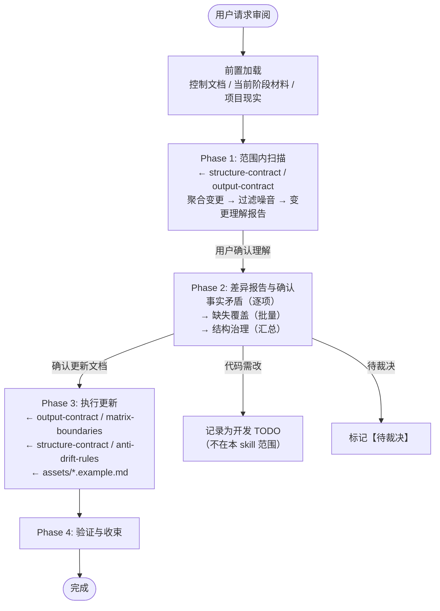

# 审阅与对齐协议

> 本文档用于定向审阅或全量对齐控制面。AI 在明确范围内对比治理正文与项目现实，找出漂移并按授权修正。

**协议心态**：审阅的核心问题是"我的文档和我的现实还在讲同一个故事吗"，不是"尽快扫完所有差异交差"。阶段性开发材料和 git 历史是理解意图、状态和变化的证据，不是需要搬运到控制文档的内容。控制文档记录的是"项目现在是什么样的"，不是"项目经历了什么"。AI 应将碎片变更聚合为模块/功能级的结构化理解，用正文准入标准过滤噪音——只保留对 AI 后续判断有控制价值的信息。审阅不是同步器，而是对齐器。

## 审阅范围

先根据用户请求确定强度：

| 模式 | 适用请求 | 扫描边界 |
|------|---------|---------|
| **定向审阅** | 指定文档、模块、功能或变化，如“审阅 SPEC”“检查 auth 文档” | 目标范围 + 保持一致所必需的直接相邻文档、代码和证据；不默认扫描无关模块或完整 Git 历史 |
| **全量审阅** | “全面对齐控制面”“整体防漂移”，或未给局部目标的综合审阅 | 完整控制面矩阵、全部相关模块、基线以来的项目现实和必要历史 |

定向审阅发现问题明显跨出原范围时，先报告扩展影响，不静默升级为全量审阅。全量审阅仍按正文准入标准过滤噪音，不以覆盖所有代码细节为目标。

## 流程概览



---

## 前置加载

在进入扫描之前：

1. 确定本次是定向审阅还是全量审阅，并写明目标范围。
2. 读取范围内控制文档：定向审阅读取目标文档及直接相邻入口；全量审阅读取 AGENTS、CLAUDE、INTENT、存在时的 ARCHITECTURE、WORKFLOW、SPEC 和全部模块文档。
3. 标记范围内已有的 `【待裁决】`，并确定相关控制文档的基线时间点。
4. 按需读取当前相关阶段材料：Design 用于理解意图与决定，Plan 用于理解暂时路径，State 用于理解当前工作状态；它们都不能替代实现证据。
5. 只在当前材料不足以解释变化时，按需读取 `docs/development/history/` 中的相关记录，不遍历无关历史。
6. 定向审阅只查看目标范围及相邻一致性所需的代码、配置、测试、运行现实和 Git 区间；全量审阅查看控制面基线以来的提交历史并扫描完整项目现实。

---

## Phase 1：范围内扫描

**目标**：在已确定范围内建立项目当前状态的充分认知，识别控制文档与现实之间的差异。

### 1.1 聚合变更

| 步骤 | 动作 |
|------|------|
| 1.1.1 | 扫描审阅范围内的代码、目录、入口、配置、依赖和运行证据，建立现实基线；全量模式才扩展到完整代码库 |
| 1.1.2 | 从相关阶段材料、必要历史和 Git 记录中提取变更事件，并保持意图、计划、状态与实现事实的身份差异 |
| 1.1.3 | 按模块/功能聚类——将分散在多个版本/commit 中的相关变更合并为一个变更事件。聚合粒度应对齐控制文档中已有的模块划分；对文档中未出现的新模块，以独立功能域为单位聚合 |
| 1.1.4 | 对每个变更事件，形成"该模块/功能的当前状态"理解，而非罗列各版本做了什么 |

**关键思维方式**：不要想"这些版本里做了什么"，而要想"如果我现在从零描述这个模块，我会怎么写？"——然后和现有模块文档对比。阶段材料声称完成但缺少代码或运行证据时，保留为未核验差异，不把它写入当前事实。

### 1.2 过滤噪音

对聚合后的变更事件，用正文准入标准（[output-contract.md](../references/output-contract.md)）过滤：

> 只有满足以下至少一条的变更，才值得进入差异报告：
> - 会长期改变 AI 的判断
> - 会改变文档边界或规范归属
> - 会改变后续协作、开发或维护方式
> - 若 AI 不知道这一点，后续很容易做错、越界或漂移

**不应进入差异报告的典型情况**：
- 纯 UI 样式调整（不影响架构理解）
- bug 修复（除非修复揭示了文档中描述的设计存在误导）
- 依赖版本升级（除非涉及 API 变化或不兼容）
- 重构但功能语义不变（除非改变了模块边界）

**过滤倾向**：宁可遗漏一个次要变更，也不要用噪音淹没控制面真正的漂移。过滤失误的后果很轻——漏掉的差异会在下次审阅或 AI 行为出问题时被发现；不过滤的后果更重——用户被迫在大量低价值差异中手动筛选。

### 1.3 交叉比对与分类

查阅 [structure-contract.md](../references/structure-contract.md)（栏目索引表、`##` 锁定规则、体量阈值）和 [anti-drift-rules.md](../references/anti-drift-rules.md)（按问题选择权威、冲突处理、禁止行为），将过滤后的变更与范围内控制文档交叉比对，并形成三类差异。
**执行策略**：按文档逐份比对。全量模式依次处理 AGENTS → INTENT → ARCHITECTURE（若存在）→ WORKFLOW → SPEC → 模块文档；定向模式只处理目标文档及维持一致所需的直接相邻文档。

| 类别 | 定义 | 典型表现 |
|------|------|---------|
| **事实矛盾** | 文档描述 ≠ 代码现实 | 已删除/废弃的功能仍在文档中、技术选型已替换但文档未更新、行为描述与代码不一致 |
| **缺失覆盖** | 代码现实未反映在文档中 | 新增模块无文档、设计决策变化未记录、运转方式变化未更新 |
| **结构治理** | 文档本身的组织问题 | 内容越界（如 SPEC 中出现了设计意图）、栏目偏移、体量膨胀、模块文档需拆分或合并 |

**分类边界**：文档中对该主题有描述但已过时→事实矛盾；文档中完全没有提及该主题→缺失覆盖。

### 1.4 变更理解报告

扫描完成后，向用户呈现对项目当前状态的聚合理解——以"模块/功能现在是什么"为单位，不是"时间线上发生了什么"：

```markdown
### 变更理解报告

**审阅时间窗口**：{基线时间} → 当前
**审阅模式与范围**：{定向 / 全量；具体文档、模块或项目范围}

**主要模块/功能的当前状态**：

| 模块/功能 | 当前状态 | 与文档的主要差距 |
|-----------|---------|----------------|
| {模块名} | {现在是什么样的——一句话} | {文档是否反映了这个状态} |

**我的理解是否正确？有遗漏或误解吗？**
```

**禁止**：
- 按 commit 粒度或版本顺序罗列变更
- 将阶段性开发记录原样搬进报告
- 报告不影响 AI 判断的实现细节变更
- 把 AI 的归因判断伪装成客观观察

**退出条件**：用户确认 AI 对项目当前状态的理解大致正确，或纠正了关键误解。

---

## Phase 2：差异报告与确认

按范围内实际出现的差异分类呈现；没有某类问题时直接省略，不为流程完整制造空报告。各类使用不同确认粒度，并持续区分可观察事实（实际存在什么）与 AI 评估（这意味着什么）。

### 第一轮：事实矛盾（逐项确认）

```markdown
### 事实矛盾

| # | 文档 | 栏目 | 文档描述 | 代码现实 |
|---|------|------|---------|---------|
| 1 | SPEC.md | 模块边界 | "单体架构，所有代码在 src/" | 已拆为 server/ + client/ 双目录 |
| 2 | WORKFLOW.md | 环节详解 | "本地构建后手动部署" | 已接入 CI 自动部署 |
```

用户逐项裁定：

| 用户判定 | 后续动作 |
|---------|---------|
| "更新文档" | → Phase 3 修正文档 |
| "代码应改回来" | → 记录开发 TODO（不在本 skill 范围） |
| "待裁决" | → 标记 `【待裁决】` |

### 第二轮：缺失覆盖（批量标记）

```markdown
### 缺失覆盖

| # | 功能/变更 | 当前状态概要 | 建议归属 |
|---|----------|------------|---------|
| 1 | proxy-validation 模块 | 三个版本迭代，已形成完整验证引擎 | MODULE 文档（新建） |
| 2 | 批量管理 API | 新增 CRUD + 批量操作 | WORKFLOW 环节 + MODULE |
| 3 | OAuth 集成 | 已接入 Linux.do OAuth | WORKFLOW 外部依赖 |
```

用户批量标记：

| 用户判定 | 后续动作 |
|---------|---------|
| "需文档化" | → AI 确认目标文档和栏目归属，Phase 3 执行 |
| "不需要" | → 跳过 |
| "待裁决" | → 标记 `【待裁决】` |

对标记"需文档化"的项目，AI 确认目标文档和栏目归属，参考 [matrix-boundaries.md](../references/matrix-boundaries.md) 进行路由。

### 第三轮：结构治理（汇总确认）

```markdown
### 结构治理

- SPEC.md「模块边界」栏目中有 3 段内容更适合放在 INTENT.md「关键设计决策」中
- WORKFLOW.md 体量已超参考上限（当前 240 行），建议拆出 2 个环节的详解到模块文档
- MODULE auth.md 的「运转位置」与 WORKFLOW.md 环节详解存在重复描述
```

用户裁定：

| 用户判定 | 后续动作 |
|---------|---------|
| "同意调整" | → Phase 3 执行结构重组 |
| "保持现状" | → 跳过 |
| "待裁决" | → 标记 `【待裁决】` |

### 历史待裁决复查

若前置加载时发现了控制文档中已有的 `【待裁决】` 标记，在三轮差异确认后统一呈现：

- 与本次扫描差异重叠的项目，已并入对应类别呈现
- 不重叠的历史待裁决项，在此集中复查——用户决定是否解决、继续搁置或移除

### Phase 2 通用约束

- 用户的批量确认（如"都更新吧"）只代表"这些项目需要文档化"，不代表对 AI 生成的具体内容细节的确认——内容仍需用户在 Phase 3 审阅
- 进入 Phase 3 前，确认每一个待更新项目都有明确的目标文档和栏目归属；路由不明确的项目在此澄清

**禁止**：
- AI 自行判断"这应该是有意的"而跳过确认
- 将三类差异混合呈现——按类别分轮，事实矛盾优先
- 把 AI 的评估判断伪装成客观事实

---

## Phase 3：执行更新

按用户确认的结果更新文档。

| 步骤 | 动作 |
|------|------|
| 3.1 | 查阅 [output-contract.md](../references/output-contract.md) 确认成文约束 |
| 3.2 | 查阅 [matrix-boundaries.md](../references/matrix-boundaries.md) 确认归属 |
| 3.3 | 查阅 [structure-contract.md](../references/structure-contract.md) 确认结构规则 |
| 3.4 | 查阅 [anti-drift-rules.md](../references/anti-drift-rules.md) 按问题选择权威并处理来源冲突 |
| 3.5 | 执行更新——以"描述当前状态"的方式写入，不以"记录版本变更"的方式写入 |
| 3.6 | 更新每份文档时，参考对应的 [assets/*.example.md](../assets/) 模板——**必须读取 HTML 注释中的写作指导和自检清单** |
| 3.7 | 以 10 行作为模块拆分的默认判断信号，结合独立职责、加载和维护边界决定内联或拆分，不机械执行 |
| 3.8 | 若需新增 `##` 栏目，提交结构变更申请（见 [structure-contract.md](../references/structure-contract.md)） |

### 模块文档的更新原则

模块文档是增量开发模式下最频繁的更新目标。更新时注意：

- **重写而非追加**：不要在现有描述后面加"v0.36 新增了 X"。应将新功能整合进模块的整体描述中，使文档始终反映模块的当前全貌
- **聚合碎片**：跨版本开发的同一功能，在模块文档中应形成统一的描述，而非版本碎片的罗列
- **控制膨胀**：每次更新后检查模块文档的内容索引表是否仍然准确，是否有 `###` 主题需要合并或拆分

### 更新后自检

每份文档更新完成后，对照对应模板（[assets/*.example.md](../assets/)）的自检清单快速验证：

- [ ] 更新内容是否符合该文档的栏目职责（未越界）？
- [ ] 文档体量是否仍在参考范围内？
- [ ] 是否引入了 changelog 式表述（"新增了 X"）而非状态式表述（"项目使用 X"）？

**禁止**：
- 更新时顺手补写用户未确认的其他内容
- 将阶段性开发记录复制到控制文档中
- 未经用户确认直接新增 `##` 栏目
- 把当前代码结构直接写成规范正文（代码现状是事实线索，不是规范结论）

---

## Phase 4：验证与收束

| 步骤 | 动作 |
|------|------|
| 4.1 | 快速重新扫描，确认事实矛盾已修正 |
| 4.2 | 各文档间一致性检查（同一事实在不同文档中的描述是否一致） |
| 4.3 | 确认 `【待裁决】` 标记状态（含历史遗留和本次新增） |

**产出**：审阅完成报告——

```markdown
### 审阅完成

- **已修正**：事实矛盾 x 项 / 缺失覆盖 y 项 / 结构治理 z 项
- **记录为开发 TODO**：M 项（文档正确，代码需修正）
- **待裁决**：K 项
- **建议**：{是否有模块需要更深入的重新对齐}
```
